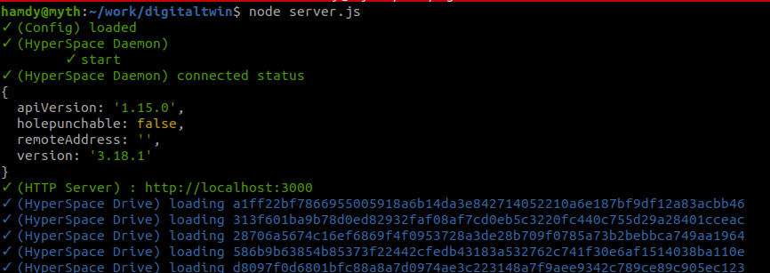
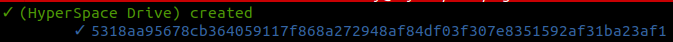

# DigitalTwin

- Install `yarn install` or `npm install`
- Run `node server.js`

# Tech overview

- When server starts
    - Starts http REST API server
    - Loads all (drives) in `db/drives.js` json file

        

- **REST Interface**
    - `POST /drive` create new drive
        - Result :: `{"key": "5318aa95678cb364059117f868a272948af84df03f307e8351592af31ba23af1"`

            
    
    - `GET /drive/{id}/{path}` List (for dirs) - Download (for files)
        - Result : `{"files": ["a.txt"]}`

}`

# Testing
- Install hyp tools `npm install -g @hyperspace/cli`
- use the hyp command to check drives i.e `hyp ls hyper://5318aa95678cb364059117f868a272948af84df03f307e8351592af31ba23af1`
